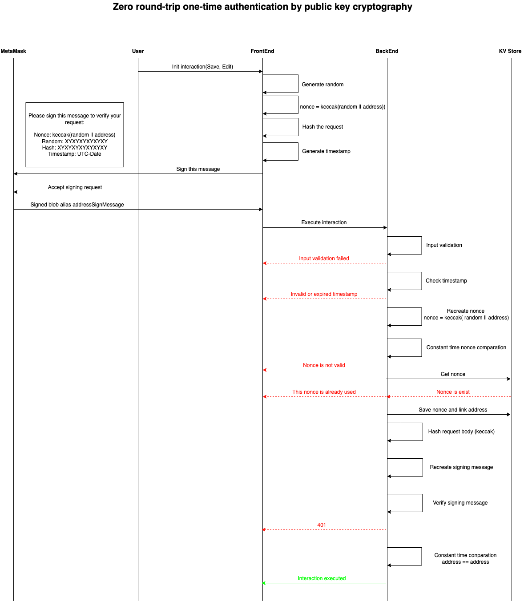

# Authentication

**One of the most common problems with digital signature-based authentication systems is the replay attack. We have developed a new authentication method against this vulnerability, which both ensures the integrity of the request independent of TLS encapsulation (HTTPS) and protects against replay based attacks. This ensures protection from the signature service (Wallet client) all the way to the API.**





Skip the explanation and use our authentication module: [github.com/agoraxyz/guildauth](https://github.com/agoraxyz/guildauth)



Authenticated request creation step-by-step:

1. Hash the payload (called hash) with the keccak256 hash algorithm

```javascript
const stringify = require('fast-json-stable-stringify');
const { ethers } = require('ethers');

let hash;
if (payload !== undefined) {
  hash = ethers.utils.keccak256(
    ethers.utils.toUtf8Bytes(stringify(payload))
  );
}
```


Hash is optional, if the request HTTP body is empty, hashing isn't required



2\. Create a random string (called random), minimum 16 maximum 128 character long

```javascript
import { randomBytes } from "crypto"

const random = randomBytes(32).toString("base64");
```


3\. Create a nonce (called nonce) with the wallet address and the random string

```javascript
const { ethers } = require('ethers');

const nonce = ethers.utils.keccak256(
    ethers.utils.toUtf8Bytes(`${address}${random}`)
);
```


The public wallet address **must be** converted to lowercase!



4\. Recreate the signing message with this template:&#x20;

With body:

```
Please sign this message to verify your request!
Nonce: ${nonce}
Random: ${random}
Hash: ${hash}
Timestamp: ${timestamp}
```

Without body:

```
Please sign this message to verify your request!
Nonce: ${nonce}
Random: ${random}
Timestamp: ${timestamp}
```

Example:

```javascript
const { ethers } = require('ethers');
const signedMessage = await wallet.signMessage(
    `Please sign this message to verify your request!\nNonce: ${nonce}\nRandom: ${random}\n${hash ? `Hash: ${hash}\n` : ""
    }Timestamp: ${timestamp}`
);
```


5\. Assemble the request

Example JSON:

```json
{
   "payload":{
      "imageUrl":"/guildLogos/52.svg",
      "name":"docs.guild.xyz",
      "urlName":"docsguildxyz",
      "description":"",
      "platform":"DISCORD",
      "platformId":"948246271053942844",
      "channelId":"948246271053942847",
      "roles":[
         {
            "urlName":"docsguildxyz",
            "chainName":"ETHEREUM",
            "imageUrl":"/guildLogos/52.svg",
            "name":"Member",
            "description":"",
            "platform":"DISCORD",
            "discord_invite":"https://discord.gg/ek8D5aSG",
            "channelId":"948246271053942847",
            "TELEGRAM":{
               "platformId":""
            },
            "logic":"AND",
            "requirements":[
               {
                  "type":"WHITELIST",
                  "value":[
                     "0x17C8ace1C94279fd68767ac12476ee53FF93C7d2"
                  ]
               }
            ],
            "DISCORD":{
               "platformId":"948246271053942844"
            }
         }
      ]
   },
   "validation":{
      "address":"0x17c8ace1c94279fd68767ac12476ee53ff93c7d2",
      "addressSignedMessage":"0xdcbbabd25d7fc06e3c97a89492e201c6d71773e38a43f5c4ff0ffd05806a56aa12fdbe97280f7eb15456f55dcf502171608a2410979eae7750140e03d7dadfe11c",
      "nonce":"0x2e6a34daa247af19cf84ce4140cf27261fb58cf56495618d1b102cbc288c4574",
      "random":"gbvGI7rokKXqwLkMZfHyHNw4mj3ho1VIV4uVOK57hXE=",
      "hash":"0x4436c6d3c8a25254e5a4c351166d6e83313c7e59cb5750845c237cb31db8cb61",
      "timestamp":"1646149975056"
   }
}
```

#### Guild creation example:

```javascript
const stringify = require("fast-json-stable-stringify");
const slugify = require("slugify");
const { ethers } = require("ethers");
const { randomBytes } = require("crypto");
const fetch = require("node-fetch");

const api = "https://api.guild.xyz/";
const name = "REPLACE-THIS-WITH-YOUR-GUILD-NAME";
const platformId = "REPLACE-THIS-WITH-YOUR-DISCORD-PLATFORM-ID";
const channelId = "REPLACE-THIS-WITH-YOUR-DISCORD-CHANNEL-ID";
const discordInvite = "REPLACE-THIS-WITH-YOUR-DISCORD-INVITE-LINK";
const mnemonic = "REPLACE-THIS-WITH-YOUR-MNEMONIC";

const wallet = new ethers.Wallet.fromMnemonic(mnemonic);
const address = wallet.address.toLowerCase();
console.log(`Wallet address: ${address}`);

const randomImageUrl = `/guildLogos/${Math.floor(Math.random() * 289)}.svg`;
const urlName = slugify(name, {
  replacement: "-",
  lower: true,
  strict: true,
});

async function prepareRequest(wallet, payload) {
  let hash;
  if (payload !== undefined) {
    hash = ethers.utils.keccak256(ethers.utils.toUtf8Bytes(stringify(payload)));
  }

  const random = randomBytes(32).toString("base64");
  const nonce = ethers.utils.keccak256(
    ethers.utils.toUtf8Bytes(`${address}${random}`)
  );
  const timestamp = new Date().getTime().toString();
  const signedMessage = await wallet.signMessage(
    `Please sign this message to verify your request!\nNonce: ${nonce}\nRandom: ${random}\n${
      hash ? `Hash: ${hash}\n` : ""
    }Timestamp: ${timestamp}`
  );

  const body = {
    payload: payload ? payload : {},
    validation: {
      address: wallet.address.toLowerCase(),
      addressSignedMessage: signedMessage,
      nonce: nonce,
      random: random,
      hash: hash,
      timestamp: timestamp,
    },
  };
  return stringify(body);
}

async function main() {
  const payload = {
    imageUrl: randomImageUrl,
    name: name,
    urlName: urlName,
    description: "",
    platform: "DISCORD",
    platformId: platformId,
    channelId: channelId,
    roles: [
      {
        urlName: urlName,
        chainName: "ETHEREUM",
        imageUrl: randomImageUrl,
        name: "Member",
        description: "",
        platform: "DISCORD",
        discord_invite: discordInvite,
        channelId: channelId,
        TELEGRAM: { platformId: "" },
        logic: "AND",
        requirements: [
          {
            type: "WHITELIST",
            value: [wallet.address],
          },
        ],
        DISCORD: {
          platformId: platformId,
        },
      },
    ],
  };

  const res = await fetch(api + "guild", {
    method: "POST",
    headers: {
      "Content-Type": "application/json",
    },
    body: await prepareRequest(wallet, payload),
  });

  console.log(
    `Status: ${res.status}\nResponse: ${JSON.stringify(await res.json())}`
  );
}

main();

```
